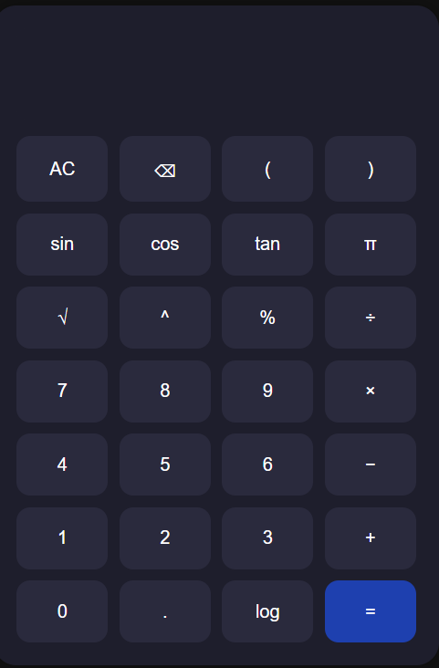

# Scientific Calculator 🧮

A beautiful and responsive **scientific calculator** built using **HTML**, **CSS**, and **JavaScript**.  
Inspired by modern mobile calculator apps.

---

## 🔧 Features

- ✅ Basic arithmetic: `+`, `−`, `×`, `÷`, `%`
- ✅ Scientific functions: `sin`, `cos`, `tan`, `log`, `√`, `^`, `π`
- ✅ Supports parentheses `()`
- ✅ Works with degrees (not radians)
- ✅ Backspace and clear (AC) buttons
- ✅ Mobile-friendly layout
- ✅ Dark mode design

---

## 📷 Screenshot

> 💡 *Make sure `screenshot.png` is in the same folder as this file.*

---

## 🚀 How to Run

1. Download or clone this repository.
2. Open `index.html` in your browser.
3. Start using the calculator!

---

## 👩‍💻 Author

**Anisha Singh**  
Made with ❤️ as a mini-project.